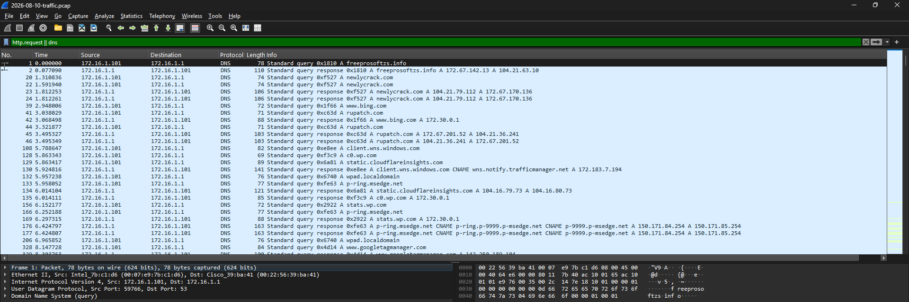
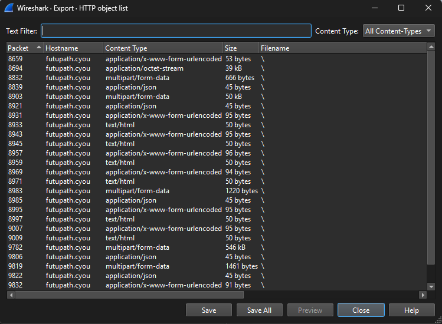
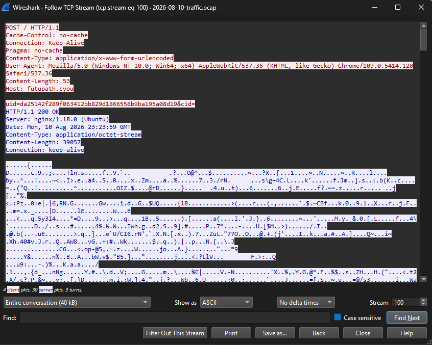

# Wireshark: Lumma Stealer-style Traffic Analysis

Analysis of a malware traffic capture from Malware-Traffic-Analysis.net (exercise dated 2026-08-10, titled "Lumma Stealer or variant"). Credit to Brad Duncan for the exercise. Practice lab only.

Source: https://www.malware-traffic-analysis.net/2026/08/10/index.html

## Environment
- Capture file: `2026-08-10-traffic.pcap` (10,172 packets)
- Client: 172.16.1[.]101
- DNS server / gateway: 172.16.1[.]1

## Findings

### 1. DNS activity
Filter: `http.request || dns` (192 of 10,172 packets displayed)

Early in the capture the client resolved several cracked-software style domains, including `freeprosoftzs[.]info` and `rupatch[.]com` (see `01-dns.png`). This is consistent with a cracked-software lure.

### 2. HTTP POSTs to a suspicious host
File → Export Objects → HTTP listed many requests to `futupath[.]cyou` (64.89.161[.]173):
- POST requests with `application/x-www-form-urlencoded` bodies containing `uid=` and `cid=` parameters
- A 39 kB `application/octet-stream` response
- Several `multipart/form-data` uploads of different sizes, including 546 kB and 50 kB

### 3. TCP stream
Followed `tcp.stream eq 100` (Follow TCP Stream): a POST to `futupath[.]cyou` with a Chrome/109 user-agent on Windows, answered by an nginx/1.18.0 (Ubuntu) server with a 39 kB binary response.

   

## Assessment
The traffic pattern (cracked-software DNS lookups, repeated POSTs with uid/cid parameters, large uploads to one host) is consistent with information-stealer activity, in line with the exercise title. This is a practice analysis, not a confirmed incident.

## IOCs (defanged)
- Domain: `futupath[.]cyou`
- IP: `64.89.161[.]173`
- Domain: `freeprosoftzs[.]info`

## Wireshark features used
- Display filter: `http.request || dns`
- File → Export Objects → HTTP
- Follow TCP Stream (`tcp.stream eq N`)

## What I learned
- Filtering first cuts a large capture down to the packets that matter
- Export Objects quickly shows what was sent and received over HTTP
- Repeated POSTs to one host with unique IDs are worth investigating
