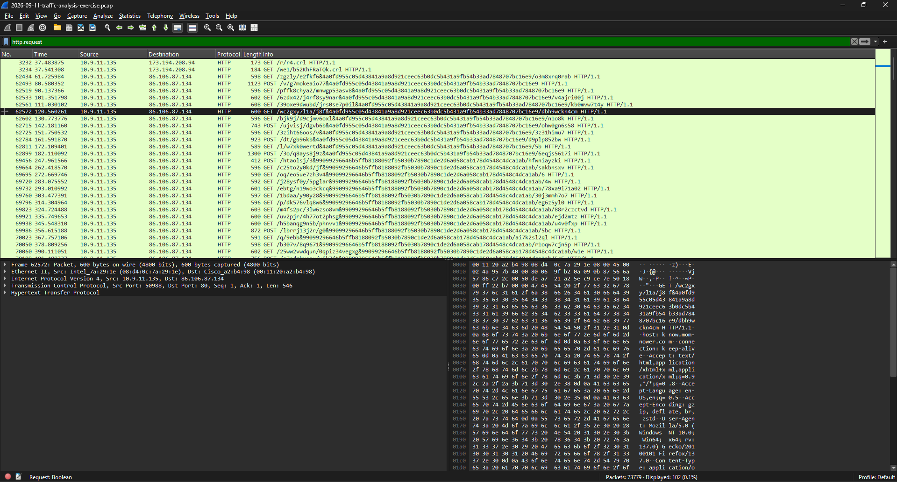
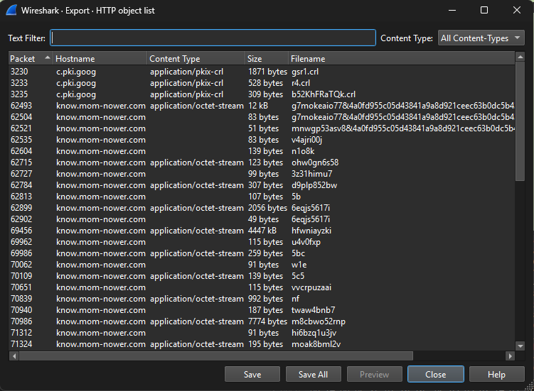
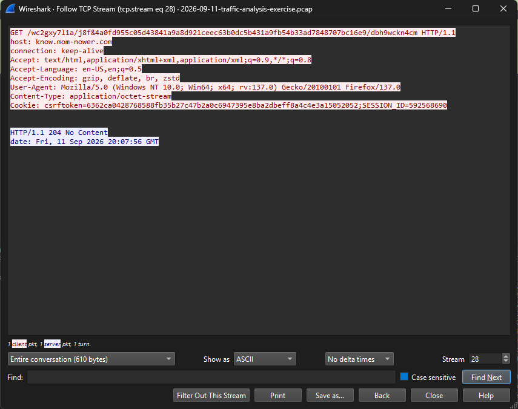

# Wireshark: Kongtuke ClickFix Traffic Analysis

Analysis of a malware traffic capture from Malware-Traffic-Analysis.net (exercise dated 2026-09-11, "Kongtuke Rebuke!"). Credit to Brad Duncan for the exercise. Practice lab only.

Source: https://malware-traffic-analysis.net/2026/09/11/index.html

## Environment (from the exercise page)
- Capture file: `2026-09-11-traffic-analysis-exercise.pcap` (73,779 packets)
- LAN segment: 10.9.11[.]0/24, gateway 10.9.11[.]1
- Active Directory domain: overhands[.]org, domain controller 10.9.11[.]2

## Findings

### 1. HTTP requests
Filter: `http.request` (102 of 73,779 packets displayed, 0.1%)

The client 10.9.11[.]135 first made a few normal-looking certificate revocation list (CRL) requests to `c.pki.goog`. After that it sent many GET and POST requests to 86.106.87[.]134 with long random-looking URIs. In the early part of the capture these requests arrived at roughly regular intervals, which suggests beaconing.

### 2. Export Objects
File → Export Objects → HTTP listed many small objects for `know[.]mom-nower[.]com`, plus a larger `application/octet-stream` object of about 4.4 MB (4447 kB) that is worth a deeper look.

### 3. TCP stream
Followed `tcp.stream eq 28` (Follow TCP Stream): a GET to `know[.]mom-nower[.]com` with a Firefox/137.0 user-agent on Windows NT 10.0 and `csrftoken` / `SESSION_ID` cookies, answered with `HTTP/1.1 204 No Content`.

## Client identification
- IP address: 10.9.11[.]135
- MAC address: 08:d4:0c:7a:29:1e (Ethernet II source of the HTTP request in frame 62572)

## Assessment
The client made many requests at near-regular intervals to one external host with long random URIs, and received mostly empty (204) replies. This is consistent with command-and-control style beaconing, in line with the exercise title (Kongtuke ClickFix). This is a practice analysis, not a confirmed incident.

## IOCs (defanged)
- Domain: `know[.]mom-nower[.]com`
- IP: `86.106.87[.]134`

## Wireshark features used
- Display filter: `http.request`
- File → Export Objects → HTTP
- Follow TCP Stream (`tcp.stream eq N`)
- Packet details pane (Ethernet II) to read the client MAC

## What I learned
- One display filter cut 73,779 packets down to about 100 requests
- Regular timing between requests is an early sign of beaconing
- The packet details pane gives the client's MAC address quickly
